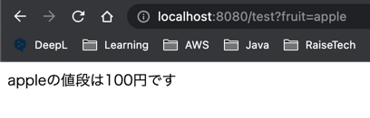
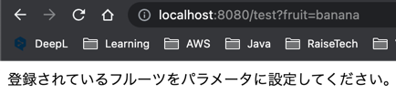

# 第6回課題

## 課題内容
- SpringBootを使って画面にHelloWorldを表示してみる
- 作成したソースコードをGitHubにpushする
- HelloWorldを表示したプロジェクトに自分で考えた変更を加えてみる
  - 例：リクエストで受け取った国（japan、us、france、korea）ごとに出すメッセージをかえる
  - 例：現在時刻を表示する
- 自分で考えた変更を新しいブランチでコミットして、GitHubにpushするGitHub上でPullRequestを作ってみる

## 実装内容
- FruitControllerを作成
- クエリパラメータを受け取り、Mapから価格を取得して表示する
### 動作確認
  - 登録されているフルーツ名を指定した場合
      

  - 登録されていないフルーツ名orパラメータが入力されていない場合
    

